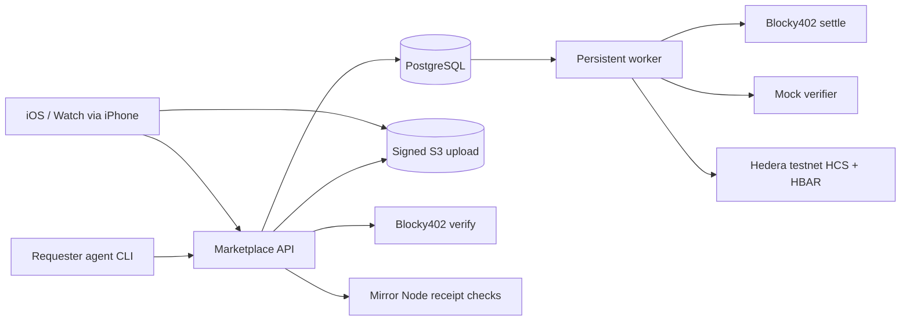

# Architecture

One Fastify API and one polling worker share a PostgreSQL database. SQL migrations define constraints; Drizzle provides the database integration and parameterized `pg` transactions handle row/advisory locks and the job queue. Zod defines input validation and generates OpenAPI request schemas. Private S3 objects contain JPEG bytes only.

## Transaction boundaries

Task transitions, idempotent responses and the associated pending job commit together. Calls to Hedera happen after committing the job. HCS events use unique `(taskId,type)` keys, strict allowlists, persisted event IDs and frozen transaction bytes.

The queue holds a PostgreSQL session advisory lock per job. A crash releases that lock; the job remains pending. A restarted worker first reconciles the persisted transaction ID through the SDK receipt and Mirror Node. It reuses the exact signed bytes when unresolved. Transaction ID regeneration is disabled in the SDK client. Confirmation and the next domain transition commit together. A confirmed reward cannot be created again because the database enforces one operation per task.

Locks on tasks serialize claims and state changes. The budget advisory lock serializes allocation against reward submission. Hash-history insertion is serialized to detect concurrent cross-task reuse. Network/database failures release DB transactions rather than committing partial state.

## Flow

Creation reserves reward funds and stores the immutable canonical specification. `TaskCreated` confirmation opens the task. A claim snapshots the worker account. Submission copies verified bytes into private content-addressed keys, commits an ordered manifest and queues `EvidenceSubmitted`. A separate durable object journal permits cleanup if the DB submission subsequently rolls back.

`EvidenceSubmitted` confirmation starts the mock verifier only for `free_mock` tasks. For immutable `x402` tasks it waits for the owning agent's purchase. The API returns an x402 v2 402 challenge, verifies the signed authorization and persists it before returning 202. A settlement job confirms payment before atomically moving to `VERIFYING` and enqueuing analysis. The versioned result moves the task to approved, rejected or manual review and queues `VerificationCompleted`. Its confirmation permits an approved reward. Successful reward confirmation moves to paid and queues `RewardPaid` independently.

Only open/claimed tasks expire. Evidence accepted before expiration remains processable afterward. Manual review is terminal, releases reservations and has no adjudication endpoint. Cancellation is available only to the requesting agent for an open, unexpired task.

## Hashes and receipts

Canonical JSON follows RFC 8785 through `canonicalize`; SHA-256 is exposed as `sha256:<lowercase hex>`. The normalized task specification includes title, instructions, QR hash, asset ID, policy, evidence requirements, reward, price limit and UTC expiry. It excludes changing status and database timestamps.

Evidence manifest: `{taskId,qrHash,answers,files:[{type,sha256}]}`, ordered lexically by type (`asset_overview`, `component_detail`). Upload IDs, S3 keys, signed URLs and submission time are not part of the aggregate. The QR hash is SHA-256 of its exact decoded UTF-8 text, with no trimming or case conversion.

Receipt verification recomputes specification/manifest hashes, checks retained file bytes, compares complete HCS messages and reward recipient/amount/memo with Mirror Node. For x402 it also checks the real purchase transaction, exact transfer and memo, evidence binding and payment-reference hash in HCS v2. Legacy HCS v1 and hashes remain unchanged. It reports mismatches, unavailable dependencies, retention deletion and indexing delay explicitly. `verified_mock_flow` describes simulated analysis, not physical truth; `checks.x402` separately proves or disclaims a verification payment.

## Verifier and payment boundaries

`VerifierAdapter` has request/recovery operations keyed by a persisted operation ID. Runtime wires only `MockVerifierAdapter`; purchasing it does not make its analysis real. `Payments` owns quotes, budget checks, authorization persistence and Blocky402 settlement. One purchase per task/verification and globally unique transaction IDs prevent duplicate purchase records. The signed memo binds the purchase UUID, while persisted requirements bind price, recipient, resource and evidence. A retry reuses signed bytes and reconciles ambiguous settlement with Mirror Node. No callback endpoint or callback secret is used. See [x402](docs/x402.md) for the protocol and recovery rules.
